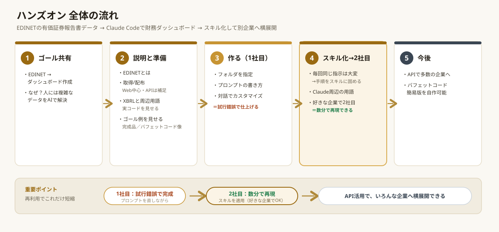
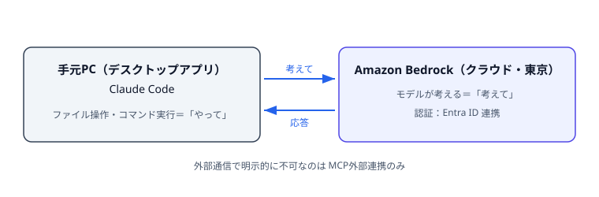
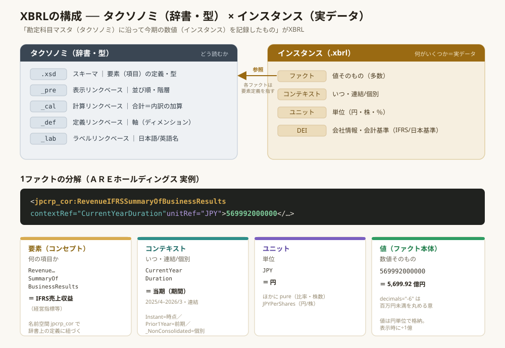
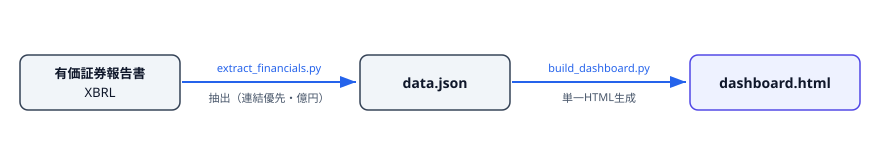
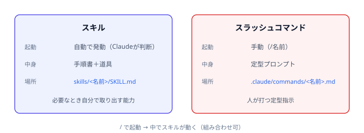
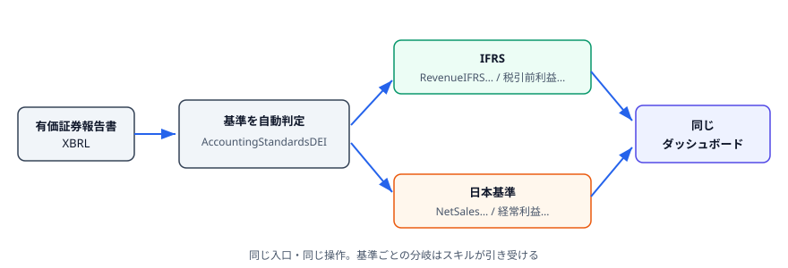
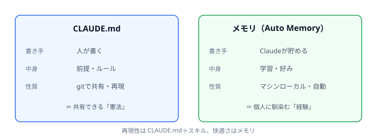

# Claude Code 研修 スライド（説明用マークダウン）

> スライド化を前提にした**説明用の下書き**。見出しは話の区切りで、**1見出し＝1スライドに固定しない**（内容量に応じて1枚にも複数枚にも割ってよい）。
> 箇条書きに削りすぎず、**図（既存SVG参照）と実コード**を同梱。長い解説は各スライド末尾から元資料へ**リンク**する。
> 章立ては `研修フロー.md` に準拠。詳細台本も `研修フロー.md`。環境＝**Amazon Bedrock ＋ デスクトップアプリの Claude Code**。

## タイトル

## Claude Code ハンズオン研修

- 題材：複雑なXMLの財務データ（XBRL）から財務ダッシュボードを作る

## アジェンダ



0. 前提 → 2. まず触ってみる → 3. 今回のゴール → 4. 準備 → 5. XBRL説明 → 6. 演習 → 7. スキル化と横展開 → 8. CLAUDE.md → 9. メモリ → 10. 応用

> 進行の詳細台本：[`研修フロー.md`](研修フロー.md)

## 0. 前提の確認（今回の目的と環境）

- **目的**: 日常業務を Claude で効率化し、**複雑な処理はAIに任せる**感覚を持ち帰る。
- **環境**: Amazon Bedrock + デスクトップアプリの Claude Code
- **制約**: MCPを利用した外部サービス連携はできない

```
[あなたの指示] → Claude Code（手元PC / デスクトップアプリ）
                     │  「考えて」＝クラウドのモデルへ
                     ▼
              Amazon Bedrock（東京リージョン / Entra ID連携）
                     │  応答
                     ▼
        「やって」＝手元PCでファイル操作・コマンド実行
```




> 詳細：[用語集 §5 Bedrockバックエンド](../../03_説明資料/html/用語集.html)

## 1. 自己紹介

TODO:

## 2. まず触ってみる（ウォームアップ）

まずは軽いお題で1回動かしてみる。コピペ用：

```
金の重量(g)と純度(%)を入力すると買取概算額を計算できる、単一HTMLのツールを作ってください。
・外部ライブラリは使わず、1ファイル(index.html)で完結
・入力はブラウザ上のフォーム、計算はその場で表示
・グラム単価は仮に9,000円/g をコード内の定数として、あとで変えやすくコメントを付ける
作成後、ローカルで開いて動作を確認する手順も教えてください。
```

### 困った時の助け舟

- **まず Claude に聞いてみる** 
- **完璧なプロンプトを目指さない**（対話で育てる）。
- **Claudeから確認が入ることがある** ← AIの時代でも**人間が判断する**場面。

> 全課題のコピペ用プロンプト：[Code用サンプルプロンプト集](../../04_演習/Code用サンプルプロンプト.md)

## 3. 今回のゴール

**有価証券報告書のXBRL → 財務ダッシュボード**を作る。

- 完成イメージ：`artifacts/AREホールディングス_財務ダッシュボード.html`（作成済みサンプル）
- 商用イメージの参照：バフェットコード
- なぜこのテーマか: **人が扱うには複雑すぎるXBRL**を、AIでまとめて可視化＝Claude Codeの得意領域。

> Copilotとの住み分け：市民開発・Office連携はCopilot／自律エージェント・複雑データ処理・コード生成はClaude Code（[用語集 §7](../../03_説明資料/html/用語集.html)）。

## 4. 課題の説明と準備

**配布物**

- 各社の有価証券報告書XBRL：`data/<社名>_<EDINETコード>/`（例：`data/トヨタ自動車_E02144/`）
- プロンプト集：[`docs/04_演習/Code用サンプルプロンプト.md`](../../04_演習/Code用サンプルプロンプト.md)

**モデルの想定**（Bedrock東京で使える範囲で相対的に）

| 向いている作業   | 使うモデル                                |
|------------------|-------------------------------------------|
| 構築（作り込み） | 上位モデル（Opus系）                      |
| 実行・横展開     | 中位（Sonnet系）→ 安定後は軽量（Haiku系） |

>  [モデル選択の考え方](../../03_説明資料/html/モデル選択の考え方.html)

**準備**：作業フォルダを Claude Code に教える。

## 5. XBRLの説明（覚えなくてよい）

構造の全体像：



- **タクソノミ**（辞書・型）＋ **インスタンス**（実データ `.xbrl`）＝ XBRL
- 数値の実体は**ファクト**。「どの期・連結/個別か」は**コンテキスト**で決まる。
- 取得は **手段1＝Web手動DL（キー不要）**。⚠️当日ハマる筆頭＝**証券コードは5桁（4桁＋末尾0）**。

> 用語の詳解：[XBRL入門](../../03_説明資料/html/XBRL入門.html)／手動DLの手順：[手段1_EDINET手動DL手順](../../05_手順/手段1_EDINET手動DL手順.md)

## 5b. XBRL：1ファクトの実例

```xml
<jpcrp_cor:RevenueIFRSSummaryOfBusinessResults
    contextRef="CurrentYearDuration" unitRef="JPY" decimals="-6">569992000000</...>
```

= 「当期の売上収益 ＝ 569,992,000,000円（≒5,700億円）」

- `contextRef="CurrentYearDuration"` … 当期・期間（フロー項目）
- `unitRef="JPY"` … 単位は円 → ダッシュボードでは÷1億して「億円」表示
- **人手で読むのは大変 → だからAIに任せる**（[XBRL入門 §ファクト/コンテキスト](../../03_説明資料/html/XBRL入門.html)）

## 6. 演習：1社目を作る

**やること**：日本語で頼むだけ。

```
data/トヨタ自動車_E02144 の有価証券報告書XBRLを解析して、主要財務をダッシュボードにして
```

**コスト作法**（＝ここが肝）：

- **巨大なXBRL本文を会話に貼らない**。ディレクトリ構成→対象タグの当たり→スクリプト化→結果だけ確認。
- 連結・通期の値を採用。単位は円→億円。

**裏で動く実処理**（スキルが実行）：

```bash
python3 skills/edinet-xbrl-dashboard/scripts/extract_financials.py \
    "data/トヨタ自動車_E02144" -o data.json
python3 skills/edinet-xbrl-dashboard/scripts/build_dashboard.py \
    data.json -o dashboard.html
```



> 手を動かす詳細（課題1＝抽出／課題2＝ダッシュボード、つまずき・助け舟つき）：[サンプルプロンプト集](../../04_演習/Code用サンプルプロンプト.md)

## 7. スキル化と横展開（会計基準の扱い）

**スキルとは**：作業の「手順書＋道具」をパッケージ化した再利用パーツ。必要時に Claude が自動で使う。

```
skills/edinet-xbrl-dashboard/
├─ SKILL.md      ← いつ・どう使うかの説明書（本体）
├─ scripts/      ← 道具（Python）
│   ├─ extract_financials.py
│   └─ build_dashboard.py
└─ assets/dashboard_template.html
```



- カスタムスラッシュコマンド：`/edinet-dashboard <パス>`（人が打つ定型指示）。
- 「1社目は試行錯誤、2社目は数分」を横展開で体感。

> スキル vs スラッシュの違い：[スキルとカスタムスラッシュコマンド](../../03_説明資料/html/スキルとスラッシュコマンド.html)／演習：[課題3（スキル化）・課題4（横展開）](../../04_演習/Code用サンプルプロンプト.md)

## 7b. 会計基準の違い：本来は大変 → Claude なら簡単



配布17社は **IFRS 11／日本基準 6**。基準で拾う科目（＝ラベル）が変わる：

| 概念     | IFRS               | 日本基準   |
|----------|--------------------|------------|
| 収益     | 売上収益           | 売上高     |
| 段階利益 | 税引前利益         | 経常利益   |
| 純利益   | 当期利益（親会社） | 当期純利益 |
| 資本     | 親会社所有者持分   | 純資産     |

Claude は DEI を見て**自動判定**し、要素名を分岐：

```xml
<jpdei_cor:AccountingStandardsDEI ...>IFRS</...>   <!-- or: Japan GAAP -->
```
```python
# 例：売上は IFRS を先に試し、無ければ日本基準へ
tags=["RevenueIFRS...SummaryOfBusinessResults",
      "NetSales...SummaryOfBusinessResults"]
```

- **同じ入口のまま** IFRS社（トヨタ）と日本基準社（三菱UFJ＝銀行）を続けて流すと両方通る。
- ここで **Claude が「会計基準どう扱う？ スキルに反映する？」と確認**＝人間が判断。
- 締めに **1社だけ原文と検算**（任せつつ人が確かめる）。

> 訴求ロジックの詳細：[XBRL入門 §会計基準の違い](../../03_説明資料/html/XBRL入門.html)

## 8. CLAUDE.md（決まり事を教える）

作業フォルダに置くと**起動時に自動で読み込まれる**「プロジェクトの前提メモ」。毎回指示しなくても品質が安定。

```markdown
# このプロジェクトについて（例）
- 対象データ: EDINET の有価証券報告書XBRL（./data/…）
- 採用方針: 連結・通期を優先。単位は円、表示は億円に換算。
- 出力: ./output/ に成果物（外部ライブラリ不可・単一HTML）
- 会計基準は自動判定（IFRS/日本基準）。銀行は解釈に注意
```

- 読み込み順（後ほど優先）：管理ポリシー → `~/.claude/CLAUDE.md`（個人）→ 上位ディレクトリ → `./CLAUDE.md` → `./CLAUDE.local.md`
- 見せ方：**「置く前／置いた後」で出力の質を比較**（＝補足A）。

> 詳解：[用語集 §3 CLAUDE.md](../../03_説明資料/html/用語集.html)／実演：[サンプルプロンプト集 補足A](../../04_演習/Code用サンプルプロンプト.md)

## 9. メモリ（対話から自動で覚える）

Claude が**対話から自動で覚える「学習ノート」**。会話で随時更新。

```
~/.claude/projects/<repo>/memory/
├─ MEMORY.md          （インデックス）
└─ feedback_*.md 等   （トピック別・オンデマンド）
```

- `/memory` で確認・編集。既定でON、マシンローカル。
- 例：「金額は億円」「銀行は営業CFを強調しない」と一度直すと次から反映される。

**CLAUDE.md との使い分け**

|        | CLAUDE.md           | メモリ                   |
|--------|---------------------|--------------------------|
| 書き手 | 人                  | Claude                   |
| 中身   | 前提・ルール        | 学習・好み               |
| 性質   | gitで**共有・再現** | マシンローカル・**自動** |



→ 再現性は CLAUDE.md＋スキル、快適さはメモリ。

> 詳解：[用語集 §4 メモリ機能](../../03_説明資料/html/用語集.html)

## 10. 応用と次の一歩

- **API横展開**：`tools/fetch_edinet_xbrl.py` で証券コード一覧から一括取得（EDINETに到達できる環境で）。
- **他業務への一般化**：同じ「決定論スクリプト＋スキル化」の型は、他の定型処理にも応用できる。
- **定期実行**：スケジュール実行で"作りっぱなし"にしない運用も可能。

## まとめ

- 複雑なXBRLも、**日本語で頼むだけ**でダッシュボードになる。
- 大変な部分（会計基準の分岐など）は**エージェントが処理し、スキルにまとめる**。
- **CLAUDE.md＝共有できる決まり事／メモリ＝個人に馴染む学習**。
- まず触る → 1社作る → スキル化して横展開、を今日持ち帰る。

## 参考資料（リンク集）

| テーマ                                                        | 資料                                                                                        |
|---------------------------------------------------------------|---------------------------------------------------------------------------------------------|
| 進行フロー（台本）                                            | [`00_導入/研修フロー.md`](研修フロー.md)                                                    |
| 用語（エージェント/スキル/CLAUDE.md/メモリ/Bedrock/トークン） | [`03_説明資料/用語集.md`](../../03_説明資料/html/用語集.html)                     |
| XBRLの構造・用語・会計基準                                    | [`03_説明資料/XBRL入門.md`](../../03_説明資料/html/XBRL入門.html)＋`xbrl-structure.svg`               |
| スキルとスラッシュコマンド                                    | [`03_説明資料/スキルとスラッシュコマンド.md`](../../03_説明資料/html/スキルとスラッシュコマンド.html) |
| モデル選択の考え方                                            | [`03_説明資料/モデル選択の考え方.md`](../../03_説明資料/html/モデル選択の考え方.html)                 |
| コピペ用プロンプト（課題0〜4＋補足）                          | [`04_演習/Code用サンプルプロンプト.md`](../../04_演習/Code用サンプルプロンプト.md)             |
| EDINET手動DL手順                                              | [`05_手順/手段1_EDINET手動DL手順.md`](../../05_手順/手段1_EDINET手動DL手順.md)                 |
